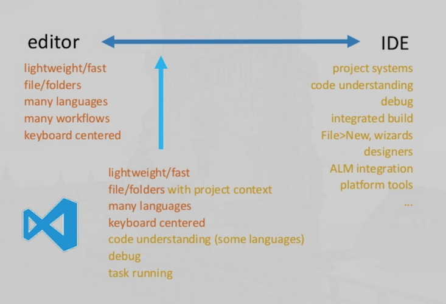
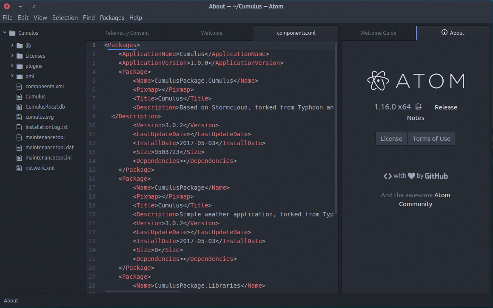
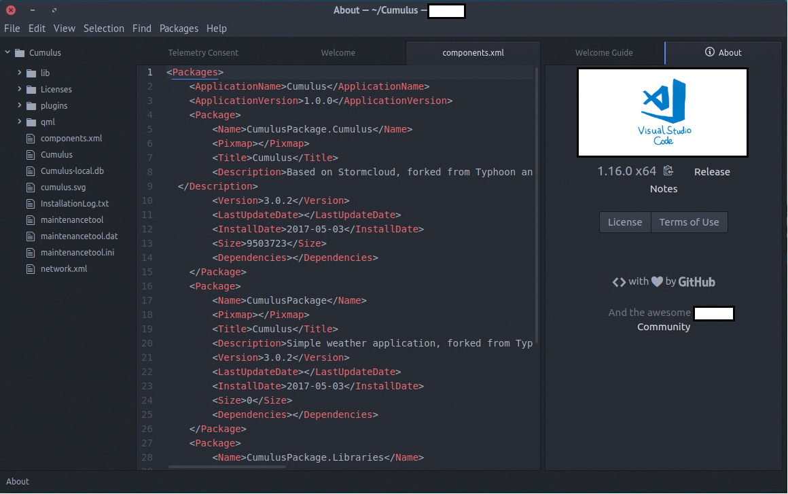
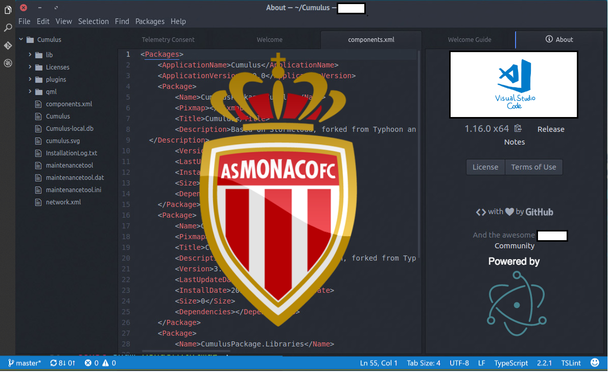
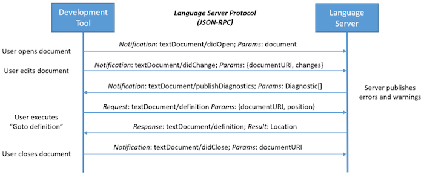
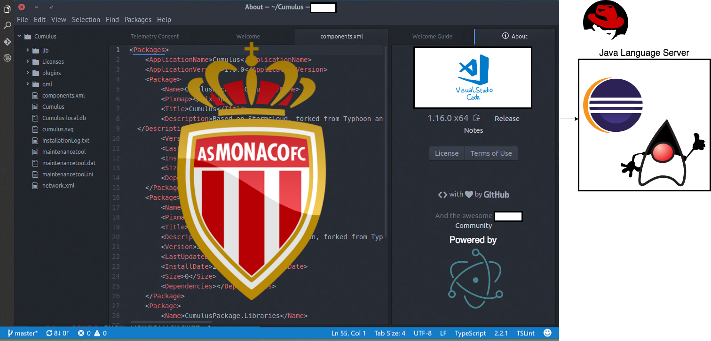

name: inverse
layout: true
class: center, middle, inverse

---

# Sé más guay desarrollando código Java con Visual Studio Code

.center[]

---

## Un servidor

.left[

* Jorge Mora Giménez
* Trabajo en "Flowable" (antes edorasware, antes mimacom, antes...)
* NO trabajo para Microsoft
* jorge@ge.org.es
* jorge.mora@edorasware.com
* @llyorshch]

---

## ¿Qué razón(es) puede(n) haber para querer dejar el cálido regazo de IntelliJ?

.center[]

---

name: text
layout: true
class: inverse

---
class: text

## 1. Cardio

.center[]

---

## 2. CuriOSSidad

.center[]

* Microsoft
* Licencia MIT (sí, estamos en la misma slide)
* Creciente popularidad
* Respaldo de grandes empresas: Microsoft (obvio), IBM y RedHat

---

## 3. Unidad

.center[]

---

## Frontend

--

.center[]

---

## Backend

--

.center[]

---

## Fullstack

--

.center[]

---

## La virtud está en el término medio

.center[]

---

## Funcionalidades destacables

* Intellisense & mejoras para la edición de código
  * Multi cursor (Alt + Cmd + Up or Down | Alt + Click | Shift + Cmd + l para selección)
  * Code Navigation & Peek
  * Refactoring (Renombrado & extracción de código)
  * Snippets
* Explorador/navegador de proyectos con soporte multi-root
* Búsqueda de ficheros, código
* SCM basado en Git
* Depurador integrado
* Gestor de extensiones
* Configurable (nivel "Pimp my ride") con "Settings" y "Themes"
* Tareas (make, rake, gulp, ...)
* Terminal integrado (Ctrl+`)
* Soporte Maven (:+1) y Gradle (meh) 
* Auto-update
* Integración con la shell del sistema

---

## Evolución - Punto de partida

--

.center[]

---

## Evolución - Demasiado descarado... ¿no?

.center[]

---

## Evolución - Ok, vamos a aportar algo

.center[]

---

## Language Server Protocol

.center[]

https://microsoft.github.io/language-server-protocol/

---

## Arquitectura del soporte Java

.center[]

---

class: center, middle, inverse

## UI Tour & Demo

???

* UI tour
  * Activity Bar & Side Bar
    * Explorer
    * Search
    * Git
    * Debug
    * Extensions
  * Editor
    * Navegación
    * Refactoring
  * Panel
  * Status Bar
* Command palette
* Tasks
* Shortcuts

* Demo
  * Creating a Spring Boot Project from scratch with Initializr Integration
  * First steps
    * Start the project as-is
    * Create a service
    * Create a controller
    * Start the project
    * Test the REST endpoint
  * Debugging
    * Breakpoints
    * Debug variables
    * Debug Console REPL
    * Hot code replacement
  * Java Test Runner
  * Git Integration
  * Integrated Terminal
  * Docker integration

---

## Moraleja(s)

* Entorno estable, pero hay bugs muy evidentes (básicamente con las extensiones)
* Prácticamente sin "scaffolding", ¡pero tiene integración con Initializr!
* Nada de "This might be replaced with a Lamba"
* Sin soporte decente de Groovy :-(
* Los controles de depuración que vienen por defecto son una lata
* En ocasiones el JLS se vuelve "loco" y la única manera de que todo vuelva a la normalidad es borrar el directorio de trabajo del mismo

---

## Extensiones básicas para ti, desarrollador Java

* [VS Code documentation main page for Java Development](https://code.visualstudio.com/docs/languages/java)
* [Docker](https://marketplace.visualstudio.com/items?itemName=PeterJausovec.vscode-docker)
* [Spring Boot Extension Pack](https://marketplace.visualstudio.com/items?itemName=Pivotal.vscode-boot-dev-pack)
* [StatusBar debugger](https://github.com/fabiospampinato/vscode-statusbar-debugger)
* [AsciiDoc](https://marketplace.visualstudio.com/items?itemName=joaompinto.asciidoctor-vscode)
* [Markdown - All in One](https://marketplace.visualstudio.com/items?itemName=yzhang.markdown-all-in-one)
* [Markdown - Lint](https://marketplace.visualstudio.com/items?itemName=DavidAnson.vscode-markdownlint)

---

## Para terminar...

--

.center[]

---
name: inverse
layout: true
class: center, middle, inverse

---

## ¡Gracias!
